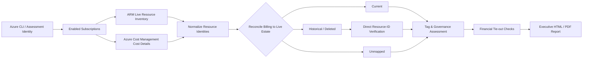

# Azure FinOps Assessment Toolkit

**Client overview:** [Client-facing case study](./CASE-STUDY.md)

## Outcome & Evidence

| Evidence | Result |
|---|---|
| Enabled subscriptions assessed | 2 |
| Current ARM resources | 15 |
| Current resource types | 11 |
| Month-to-date actual cost | 4.5931 CAD |
| Active spend | 0.0000 CAD |
| Historical / deleted spend | 4.5931 CAD |
| Unmapped spend | 0.0000 CAD |
| Reconciliation checks | 10 / 10 passed |
| Largest validated cost driver | Deleted Azure VPN Gateway, 98.7% of MTD spend |
| Governance finding | 0 of 15 live resources carried all required CostCenter, Owner, and Environment tags |

**Proof:** [View the executive sample PDF](./sample-output/Azure-FinOps-Executive-Assessment-Sample.pdf) · [Read the case study](./CASE-STUDY.md)

## Architecture at a glance



---

A production-oriented PowerShell toolkit for assessing Azure cost, resource state, governance, and financial accountability across one or more subscriptions.

The toolkit inventories the live Azure estate, retrieves Azure Cost Management actual-cost data, reconciles billing records against Azure Resource Manager resources, verifies suspected deleted resources, evaluates tagging coverage, performs financial tie-out checks, and produces an executive-ready assessment.

It is designed for cloud architects, FinOps practitioners, platform engineers, Azure administrators, consultants, and organizations that need a repeatable way to answer a simple but important question:

> **What are we paying for in Azure, what still exists, what has been deleted, who owns the cost, and can the numbers be trusted?**


## Client-ready sample

**View the finished assessment:** [Azure FinOps Executive Assessment - Sample PDF](./sample-output/Azure-FinOps-Executive-Assessment-Sample.pdf)

The sample demonstrates the end-to-end deliverable: live Azure inventory, Cost Management reconciliation, deleted-resource verification, governance findings, executive actions, and financial tie-out checks.

**Consulting inquiries:** advisory@cloudgenius.ca · https://cloudgenius.ca

---

## Why this project exists

Azure Cost Management can show spend, and Azure Resource Manager can show deployed resources, but organizations often need more than either view provides on its own.

This toolkit brings those views together.

It helps identify:

- current Azure resources that are actively generating cost;
- historical charges tied to resources that no longer exist;
- billable items that are not mapped cleanly to a live resource;
- subscriptions, services, resource groups, and resources driving spend;
- missing or inconsistent governance tags;
- gaps in cost ownership and showback/chargeback readiness;
- residual charges after infrastructure has been decommissioned;
- whether executive cost figures reconcile from multiple independent views.

The result is a reusable FinOps assessment rather than a one-off billing export.

---

## What the toolkit does

### Azure estate discovery

- Enumerates enabled Azure subscriptions available to the signed-in identity.
- Inventories current Azure Resource Manager resources.
- Captures resource type, resource group, subscription, resource ID, location, and available tags.
- Distinguishes top-level resources from child resources where relevant.

### Cost Management analysis

- Retrieves actual month-to-date Azure Cost Management data.
- Uses Azure Cost Management asynchronous cost-detail reports.
- Processes billing data per subscription.
- Consolidates cost without mixing currencies.
- Breaks down spend by:
  - subscription;
  - service;
  - resource group;
  - resource;
  - governance tag.

### Resource-to-billing reconciliation

Billing records are reconciled against the live Azure Resource Manager inventory.

Resources are classified as:

| State | Meaning |
|---|---|
| **Current** | The billed resource exists in the live Azure estate. |
| **Historical / Deleted** | The billing record points to a resource that is no longer deployed and deletion has been independently checked. |
| **Unmapped** | The charge cannot be safely tied to a specific live resource, such as certain purchases, adjustments, refunds, or support-related charges. |

The toolkit does not classify a resource as deleted merely because it has zero cost.

### Deleted-resource verification

When a billed resource appears to be absent from the current estate, the toolkit performs a direct lookup using the exact Azure resource ID.

This provides a stronger evidence trail than relying only on an inventory comparison.

The report distinguishes:

- confirmed deleted resources;
- resources found to still exist;
- resources that could not be independently verified.

### Governance and tagging assessment

The current implementation assesses required governance tags including:

- `CostCenter`
- `Owner`
- `Environment`

It measures:

- tag coverage;
- fully tagged resource count;
- missing required tags;
- tag naming/value quality;
- cost attributed to tagged and untagged resources.

The output includes practical recommendations for Azure Policy-based inheritance and enforcement.

### Financial reconciliation

The assessment performs independent tie-out checks before treating the report as complete.

Examples include:

- Active + Historical/Deleted + Unmapped = MTD actual cost
- Sum of subscriptions = MTD actual cost
- Sum of services = MTD actual cost
- Sum of resource groups = MTD actual cost
- Sum of resource cost lines = MTD actual cost
- Required-tag totals = MTD actual cost
- Live resources with cost + without cost = total live resources
- Aggregated cost lines = cost lines returned by Azure

This helps make the output suitable for engineering review, FinOps discussions, and executive reporting.

---

## Practical assessment result

A real assessment run against the CloudGenius Azure environment produced the following result:

| Metric | Result |
|---|---:|
| Enabled subscriptions assessed | 2 |
| Current ARM resources | 15 |
| Current resource types | 11 |
| Month-to-date actual cost | **4.5931 CAD** |
| Active spend | **0.0000 CAD** |
| Historical / deleted spend | **4.5931 CAD** |
| Unmapped spend | **0.0000 CAD** |
| Reconciliation checks | **10 / 10 passed** |

The assessment determined that 100% of recorded month-to-date spend came from networking resources that had already been removed from the live environment.

The largest historical charge was:

- `vng-cloudgenius-azure`
- Azure VPN Gateway
- **4.5326 CAD**
- **98.7% of month-to-date spend**
- independently confirmed as deleted by direct Azure resource lookup.

A related public IP accounted for the remaining **0.0605 CAD**.

The same run also identified that all 15 current resources were missing the required `CostCenter`, `Owner`, and `Environment` governance tags, creating a clear remediation path before active spend grows.

This is the type of result the toolkit is intended to surface: not only **how much Azure costs**, but **why the cost exists, whether the resource still exists, and what should be corrected next**.

---

## Example executive output

The generated assessment includes:

- executive financial headline;
- spend-at-a-glance metrics;
- active vs. historical vs. unmapped cost;
- primary cost drivers;
- Azure estate summary;
- governance readiness;
- tagging recommendations;
- resources missing required tags;
- prioritized executive actions;
- leadership decision points;
- financial planning notes;
- cost by subscription;
- cost by service;
- cost by resource group;
- cost by resource;
- cost by tag;
- current Azure resource inventory;
- historical/deleted resource details;
- final reconciliation checks;
- methodology and evidence notes.

The HTML report is designed to be readable by both technical and non-technical stakeholders and can be printed to PDF for portfolio, audit, consulting, or management use.

---

## Where this is useful

This toolkit can be adapted for organizations of different sizes because it discovers the Azure estate dynamically rather than depending on a fixed list of CloudGenius resources.

Typical use cases include:

### Cloud cost assessment

Establish a defensible current view of Azure spend and identify the resources, services, and subscriptions responsible for it.

### Post-decommission validation

Determine whether recently removed infrastructure is still generating cost and verify that deleted-resource charges stop appearing.

### FinOps maturity assessment

Evaluate whether the environment has the ownership, tagging, and reporting foundations needed for showback or chargeback.

### Azure governance review

Identify untagged resources and create a practical path toward Azure Policy-based tag inheritance and enforcement.

### Cloud architecture review

Combine live ARM inventory with cost data to understand what is deployed, where it lives, and whether the financial footprint matches the intended architecture.

### Consulting discovery assessment

Use the toolkit during an Azure discovery engagement to create an evidence-backed baseline before recommending optimization, governance, or modernization work.

### Continuous cost-control validation

Run the assessment periodically to detect new cost drivers, confirm historical charges disappear, and monitor governance improvement over time.

---

## Architecture and methodology

At a high level, the workflow is:

```text
Azure CLI authentication
        |
        v
Discover enabled subscriptions
        |
        +---------------------------+
        |                           |
        v                           v
Azure Resource Manager       Azure Cost Management
live resource inventory      actual cost-detail data
        |                           |
        +-------------+-------------+
                      |
                      v
             Normalize identifiers
                      |
                      v
       Reconcile billing to live estate
                      |
             +--------+--------+
             |        |        |
             v        v        v
          Current  Historical  Unmapped
                   / Deleted
                      |
                      v
          Direct deletion verification
                      |
                      v
          Governance/tag assessment
                      |
                      v
            Financial tie-out checks
                      |
                      v
       Executive HTML / PDF assessment
```

The methodology intentionally separates resource existence from cost amount.

A resource with zero cost can still be a current resource.

A resource with historical cost is only treated as deleted when the billing identity can be reconciled against the assessed subscription and its absence can be independently verified.

---

## Repository structure

```text
azure-finops-assessment-toolkit/
|
|-- README.md
|-- LICENSE
|-- .gitignore
|
|-- src/
|   `-- Azure-FinOps-Assessment.ps1
|
|-- sample-output/
|   `-- Azure-FinOps-Executive-Assessment-Sample.pdf
|
|-- docs/
|   |-- methodology.md
|   |-- permissions.md
|   `-- limitations.md
|
`-- examples/
    `-- sample-config.ps1
```

---

## Requirements

The assessment is intended to run from a workstation or administrative environment with:

- PowerShell 7+ recommended;
- Azure CLI;
- access to the target Azure tenant;
- sufficient Azure Resource Manager read permissions;
- sufficient Azure Cost Management permissions for the subscriptions being assessed.

Exact permissions should follow least-privilege principles.

For enterprise use, a dedicated read-only assessment identity is preferable to using a highly privileged administrator account.

---

## Running the assessment

Authenticate to Azure:

```powershell
az login
```

Confirm the expected tenant and subscriptions:

```powershell
az account list --output table
```

Run the assessment:

```powershell
pwsh ./src/Azure-FinOps-Assessment.ps1
```

The script retrieves fresh Azure data, performs the assessment, and generates its output package.

> Review the script parameters and permissions before running it against a production environment.

---

## Output artifacts

Depending on configuration, the assessment can produce structured evidence files such as:

```text
01-Cost-By-Resource.csv
02-Cost-By-Subscription.csv
03-Cost-By-Service.csv
04-Cost-By-Resource-Group.csv
05-Current-Resources.csv
06-Current-Resources-No-MTD-Cost.csv
07-Historical-Deleted-Resource-Cost.csv
08-Cost-By-Currency.csv
09-Raw-Cost-Details-Normalized.csv
10-Executive-Summary.csv
11-Executive-Actions.csv
12-Governance-Readiness.csv
13-Cost-By-Tag.csv
14-Final-Calculations.csv
15-Untagged-Cost.csv
16-Tag-Quality-Findings.csv
Executive-Summary.json
```

These files provide traceability behind the executive report and allow the results to be reused in further analysis or automation.

---

## Designed for reuse across Azure environments

The toolkit is designed to be environment-agnostic where possible.

It discovers:

- subscriptions;
- resource groups;
- resource IDs;
- resource types;
- services;
- billing records;
- currencies;
- tags;
- current and historical resource state

from Azure at runtime.

It does not require an organization to use CloudGenius naming conventions.

Organizations can extend the governance section with additional required tags such as:

- `Application`
- `BusinessUnit`
- `Project`
- `DataClassification`
- `Criticality`
- `ManagedBy`

The same assessment pattern can therefore be applied to development, test, production, landing-zone, hybrid-cloud, and multi-subscription Azure estates, subject to permissions and the Azure billing data available to the executing identity.

---

## Security and privacy

Before publishing or sharing assessment output, review all exported data.

Raw and supporting files may contain:

- subscription IDs;
- resource IDs;
- resource names;
- resource-group names;
- tags;
- ownership information;
- internal architecture details;
- billing metadata.

The executive report is intended to minimize unnecessary identifiers, but every organization should apply its own information-handling policy.

Never place credentials, secrets, access tokens, private keys, or sensitive personal information in Azure tags or public assessment output.

---

## Limitations

This toolkit is an assessment and reporting framework, not an accounting system.

Current limitations may include:

- Azure budgets are not automatically assessed unless specifically implemented;
- the report does not replace the official Azure invoice;
- Azure's official Cost Management forecast is separate from the toolkit's calculations;
- anomaly alerting may require additional configuration;
- commitment utilization and savings-plan analysis requires sufficient historical usage data;
- some Azure billing records may not map to a specific ARM resource;
- results depend on the permissions and billing scope visible to the signed-in identity.

Financial and accounting treatment should always follow the organization's approved policies and applicable standards.

---

## Engineering principles used

This project is built around several principles that are important in enterprise cloud engineering:

- **Evidence before assumption** — resource state is verified where possible.
- **Reconciliation before reporting** — headline figures must tie back to detailed data.
- **Least privilege** — assessment access should be read-only wherever practical.
- **Repeatability** — the same workflow should be runnable again after remediation.
- **Separation of technical state and billing state** — a resource can be deleted while charges remain in the current billing period.
- **Executive readability** — engineering evidence should be translated into clear business actions.
- **Governance by design** — cost ownership should be built into platform standards rather than added after spend becomes material.

---

## Roadmap

Planned areas for expansion include:

- Azure budget discovery and assessment;
- cost anomaly detection;
- Reservation and Savings Plan utilization analysis;
- Azure Policy compliance integration;
- Microsoft Defender for Cloud posture;
- Azure Arc coverage;
- Azure Monitor Agent and DCR coverage;
- Microsoft Sentinel configuration and ingestion analysis;
- broader cloud governance scoring;
- scheduled assessment runs and trend reporting.

The long-term goal is to evolve the toolkit from a FinOps assessment into a broader Azure environment assessment covering **cost, governance, security, operations, and architecture**.

---

## Professional services

This project reflects the same assessment approach that can be used in real Azure consulting engagements.

Organizations may use this type of assessment to establish a baseline before:

- Azure cost optimization;
- cloud governance implementation;
- landing-zone improvement;
- Azure Policy rollout;
- subscription and management-group restructuring;
- hybrid and Azure Arc adoption;
- Microsoft Sentinel onboarding;
- security posture improvement;
- platform engineering and automation;
- cloud modernization.

If your organization needs an Azure cost, governance, security, or architecture assessment adapted to its environment, CloudGenius can help design and implement the remediation work that follows the assessment.

**CloudGenius**  
Cloud Architecture · Cybersecurity · DevOps · FinOps · Hybrid Infrastructure

---

## Disclaimer

This project provides technical and FinOps assessment information only.

It does not replace official Azure billing records, accounting advice, contractual commitments, organizational financial policy, or Microsoft support.

Validate all findings before making production or financial decisions.

---

## License

Released under the MIT License.
